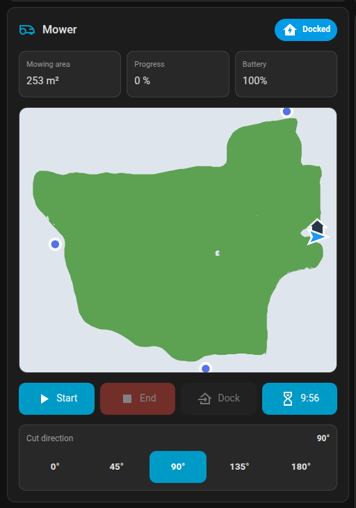

# Ecovacs GOAT G1 for Home Assistant

A mower-only Home Assistant custom integration for ECOVACS GOAT G1 lawn mowers.

It gives you a lawn mower entity, useful sensors, mower settings, and an optional dashboard card with map, start, stop, dock, and cut-direction controls.



## Important

This is an unofficial community project. It is not affiliated with, endorsed by, certified by, or supported by ECOVACS.

Use it at your own risk. A robotic mower has moving blades and can cause damage or injury if used unsafely. Always keep the mower in sight when testing new commands, and stop using the integration if either Home Assistant or the official ECOVACS app loses reliable control.

## Tested Mower

Developed and tested with an **ECOVACS GOAT G1-800**.

No promise is made that it will work with any other mower model. ECOVACS vacuums are not supported.

## Why This Integration Exists

This project is separate from Home Assistant's regular ECOVACS integration. It was created because the regular Ecovacs/Home Assistant path is built around a broader vacuum-oriented command stack, while this project only targets GOAT mowers and uses behavior observed from the official ECOVACS app.

The goal is to keep communication with the mower conservative: use pushed updates where possible, refresh state only when needed, and avoid broad background polling.

## Features

- Start or resume mowing, stop mowing, and return to dock.
- Battery, error, Wi-Fi, current mow, total mow, and consumable sensors.
- Settings for rain delay, animal protection, AI recognition, edge mowing, safer mode, warning switches, cut direction, mowing efficiency, and obstacle avoidance.
- Diagnostic model-line and feature information to help identify G1 variants.
- Optional Lovelace card with a live map and clear mower controls.
- Opt-in debug capture tools for troubleshooting.

## Installation With HACS

Until this is available as a default HACS repository, add it manually:

1. In Home Assistant, open **HACS**.
2. Open the three-dot menu and choose **Custom repositories**.
3. Add `https://github.com/Janverhu/ecovacs-goat-g1`.
4. Select category **Integration**.
5. Install **Ecovacs GOAT G1**.
6. Restart Home Assistant.
7. Add the integration from **Settings -> Devices & services -> Add integration**.

## Setup

You need your ECOVACS account username, password, and country. The integration uses the ECOVACS cloud, just like the official app.

During setup, choose a Home Assistant device name. A generated default such as `Ecovacs-GOAT-1` is provided.

## Optional Dashboard Card

The custom card is optional, but recommended. It exposes a clear stop button and a mower-focused map layout.

To install it:

1. Copy `www/ecovacs-goat-card.js` from this repository to your Home Assistant config directory as `www/ecovacs_goat/ecovacs-goat-card.js`.
2. In Home Assistant, open **Settings -> Dashboards -> Resources**.
3. Add a JavaScript module resource:

```text
/local/ecovacs_goat/ecovacs-goat-card.js
```

After the resource is loaded, add **Ecovacs GOAT Card** from the custom card picker.

Example YAML:

```yaml
type: custom:ecovacs-goat-card
entity: lawn_mower.mower
battery_entity: sensor.mower_battery_level
error_entity: sensor.mower_error
area_entity: sensor.mower_mowing_area
progress_entity: sensor.mower_mowing_progress
direction_entity: number.mower_cut_direction
stop_button: button.mower_end_mowing
name: Mower
```

## How It Behaves

The integration tries to be conservative with the mower and cloud connection:

- It prefers live updates pushed by ECOVACS.
- It refreshes state at startup and when data is stale.
- It avoids broad background polling loops.
- The card can request a short live-map session while the map is visible.

For technical protocol notes, see `docs/protocol-summary.md`.

## Debug Capture

If a model or feature does not work, use the debug capture services before opening an issue. Captures are disabled by default and stored locally under `/config/ecovacs_goat_g1_debug/`.

Recommended workflow:

1. Call `ecovacs_goat_g1.start_debug_capture` from **Developer Tools -> Services**.
2. Reproduce the problem.
3. Optionally call `ecovacs_goat_g1.mark_debug_capture` at useful moments.
4. Call `ecovacs_goat_g1.stop_debug_capture`.
5. Download Home Assistant diagnostics or call `ecovacs_goat_g1.export_debug_capture`.

Do not share passwords, access tokens, device IDs, or private network details publicly.

## Troubleshooting

- If entities are unknown after setup, press **Refresh state** once the mower is online.
- If commands fail, check whether the official ECOVACS app can still control the mower.
- If both Home Assistant and the official app lose contact with the mower, stop testing and recover the mower first.
- When opening an issue, include the integration version, mower model, Home Assistant logs, and the action that failed.

## Safety

Only use mower commands when the mower is in a safe outdoor state. Keep people, pets, and objects away from the mower while testing. If behavior looks wrong, stop the mower with the official app or physical controls first.

This software is provided without any warranty. Compatibility is best effort and may change if ECOVACS changes its app, cloud service, firmware, or account behavior. You are responsible for deciding whether it is safe to use with your mower and property.

ECOVACS and GOAT names and trademarks belong to their respective owner. This project does not claim any ownership of ECOVACS branding or official assets.

## More Information

- `docs/protocol-summary.md` has sanitized protocol notes.
- `CONTRIBUTING.md` explains the development scope.
- `SECURITY.md` explains what not to share publicly.
- `ACKNOWLEDGEMENTS.md` credits related community work.

## License

MIT License. See `LICENSE`.
